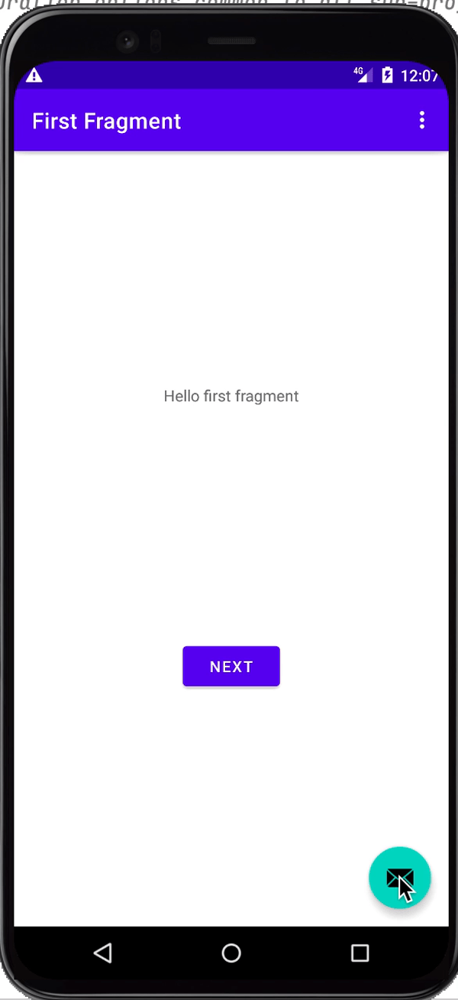

## Android Transform Animation using Shared Element Transition Technique

Note: Take a look at the transitionName attribute in the layout files.

The animation is started by calling startActivity in the MainActivity.kt file.
